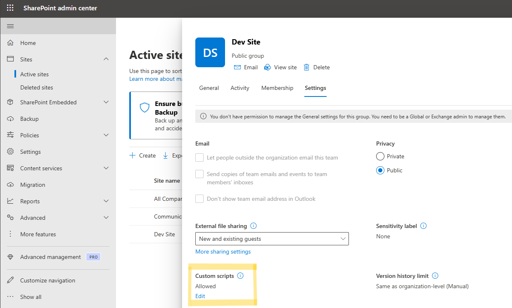
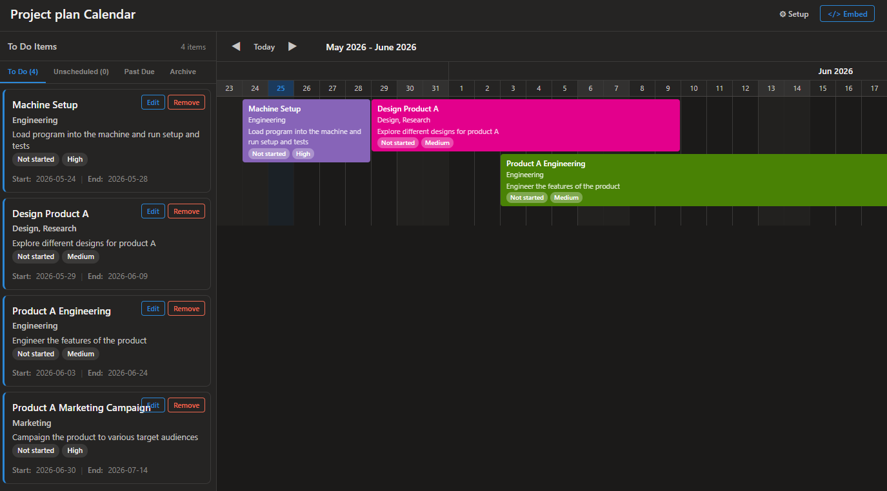
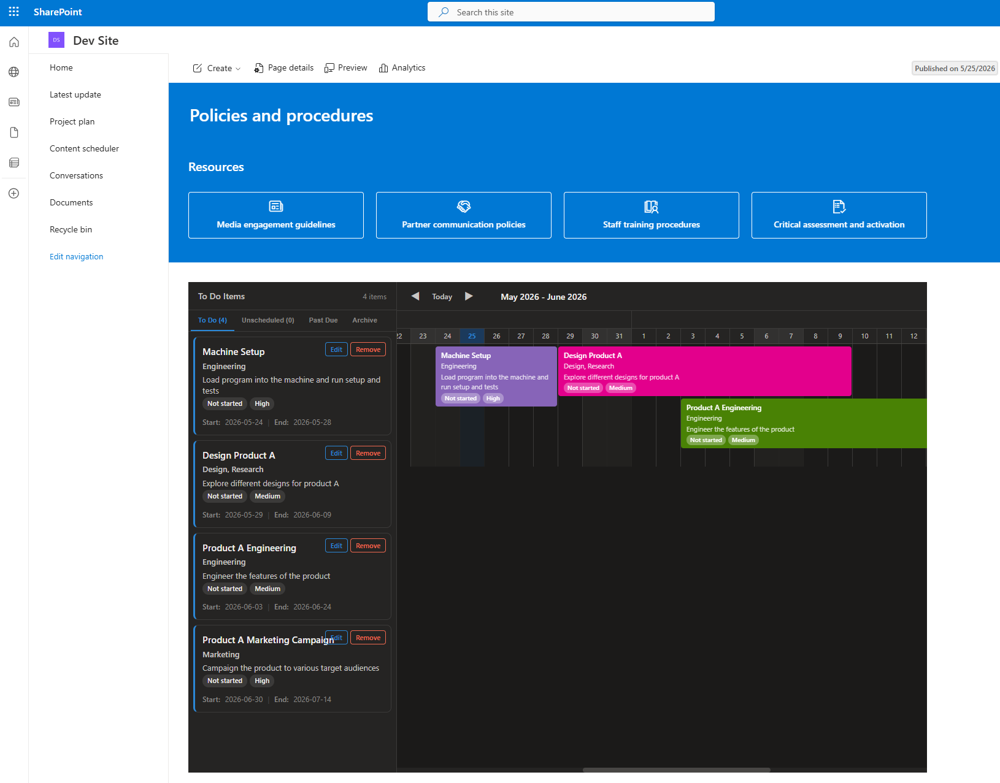

# SharePoint Modern Timeline Calendar

A premium, fully self-contained, responsive client-side web application (`SPCalendar.aspx`) that brings a stunning, interactive horizontal timeline and Gantt-style planning view to any SharePoint list. 

Built entirely with modern Vanilla HTML, CSS, and JavaScript, it integrates seamlessly with SharePoint using the native REST API, requiring **zero** compilation, **zero** external library dependencies, and a simple one-time custom script activation by an administrator.

---

## 🌟 Key Features

*   **Interactive Horizontal Timeline Layout:** Ditch the cramped, traditional monthly grids. View list events, planning roadmaps, and scheduling milestones side-by-side in a fluid Gantt-like timeline with color-coded blocks.
*   **Dual-Panel Experience:** A dynamic, scrollable sidebar displays items as adaptive card components with custom filters, counts, and quick-action triggers.
*   **Modern Theme-Aware UI:** Built using standard Fluent Design tokens with full support for system **Dark Mode** (`prefers-color-scheme`), modern typography (Segoe UI / Fluent UI), glassmorphism styles, hover micro-animations, and fluid transitions.
*   **Built-in Interactive Setup Wizard:** An intuitive, user-friendly wizard runs on initial load to let you select lists from your SharePoint site and visually map list columns to calendar visual styles (heading, subheading, labels, regular descriptions) without writing a line of code.
*   **Mobile-First Responsive Design:** Adapts smoothly to smaller screens, featuring a dedicated Mobile View Switcher that toggles between a clean Calendar Timeline and a structured List view.
*   **Embed-Ready Architecture:** Designed to work standalone or be embedded cleanly within modern SharePoint pages using the standard **Embed Web Part** (incorporating a dedicated frame mode that hides header chrome).
*   **No SPFx App Deployment Hassles:** Deploys directly by uploading to a Document Library or Site Assets folder. No complex SharePoint Framework (SPFx) package builds, tenant-wide catalog registration, or global admin deployment approvals are required.

---

## ⚔️ Comparison: Modern Timeline Calendar vs. Standard SharePoint Calendar

| Feature / Aspect | 🌟 SharePoint Modern Timeline Calendar | 🏛️ Standard SharePoint Calendar View |
| :--- | :--- | :--- |
| **Grid Layout** | Horizontal timeline/Gantt view showing overlapping multi-day tasks side-by-side. Excellent for schedules and planning. | Rigid traditional calendar grid (Month/Week/Day) with overlapping events stacked vertically, easily cutting off text. |
| **Styling & Theme** | Modern Fluent UI aesthetics with custom typography, responsive design, and automatic **Dark Mode** support. | Outdated UI aesthetics that do not adapt to system dark mode or modern layouts natively. |
| **Dynamic Column Mapping** | Dynamic Setup Wizard allows mapping *any* SharePoint column (Title, Choice, Person, Text, Lookup) to visual zones (Headings, Labels, Rich Text). | Restricted to binding hardcoded fields (Title, Start Time, End Time, Description). |
| **Sidebar & Detail Cards** | Responsive sidebar panel with search, tab filtering, and detailed visual cards showing metadata at a glance. | Standard list items open in generic modern SharePoint forms or popup dialogs. |
| **Deployment & Security** | Client-side, runs in sandboxed contexts. Requires a one-time Custom Script activation, zero package installation, zero NuGet/NPM/build pipeline. | Requires building SharePoint Framework (SPFx) web parts or configuring complex JSON formatting. |
| **Mobile Experience** | Dedicated mobile layout with an intuitive calendar-to-list view switcher for touchscreens. | Standard month views collapse poorly on mobile, making event text completely illegible. |

---

## 🚀 Easy Installation & Setup

Deploying the Modern Timeline Calendar is straightforward but requires one crucial prerequisite step to ensure SharePoint executes the `.aspx` page correctly in the browser rather than forcing a file download.

### 1. Prerequisite: Enable Custom Scripting
An administrator must enable Custom Scripts for the target SharePoint site from the SharePoint Admin Center. Otherwise, the `.aspx` file will be treated as a static asset and force a download when clicked.

1. Navigate to the **SharePoint Admin Center** (e.g., `https://yourtenant-admin.sharepoint.com`).
2. In the left navigation, go to **Sites** > **Active Sites**.
3. Select your target SharePoint site from the list.
4. Click on the **Settings** tab at the top of the details panel.
5. Scroll down to **Custom script** and change it to **Allowed** (as shown in the screenshot below).
6. Save the settings. 

> [!NOTE]
> SharePoint automatically turns custom scripts off again after 24–48 hours for security. This is perfectly fine! The scripting permission is only required during the file upload/creation step; the page will continue to run normally after it has been uploaded.

### 2. Upload to SharePoint
1. Download or clone this repository and locate the [SPCalendar.aspx](SPCalendar.aspx) file.
2. Navigate to your target SharePoint site.
3. Open a Document Library (such as **Site Assets** or **Site Pages**).
4. Drag and drop [SPCalendar.aspx](SPCalendar.aspx) to upload it.

### 3. Configure Your Calendar
1. Click on the uploaded `SPCalendar.aspx` file to open it in your browser.
2. The **Setup Wizard** will automatically launch.
3. Select your desired SharePoint list.
4. Set the **Start Date** and **End Date** field columns from your list.
5. Map your list columns to visual fields:
   * **Heading:** Main title of the timeline block and card.
   * **Subheading:** Secondary metadata line.
   * **Labels:** Categorical choices or tags (rendered as styled badges).
   * **Regular:** Descriptive text block.
6. Click **Save Configuration**. Your calendar is now fully functional!

### 4. Embed on a Page (Optional)
1. Click the **Embed** `</>` button in the calendar header.
2. Click **Copy to Clipboard** to copy the pre-generated iframe HTML.
3. Go to any modern SharePoint page and click **Edit**.
4. Add the **Embed Web Part** to your section.
5. Paste the iframe code. The calendar automatically detects embed mode, hiding the top header to fit seamlessly into your page!

---

## 🛠️ Configuration & Customization

Under the hood, the app stores its configuration as a hidden file in your page library, using `localStorage` as a fast fallback. 

If you ever need to point your calendar to a different list or re-map your fields:
1. Click the **Gear icon (Setup)** in the upper-right corner of the header.
2. Re-run the interactive wizard to save your updated settings.

## 🔒 Security & Privacy

* **100% Client-Side:** The application executes entirely in the user's browser context.
* **No External APIs:** Your data never leaves your SharePoint environment. The app interacts *only* with native SharePoint REST endpoints (`/_api/...`).
* **Inherited Permissions:** Respects your SharePoint permissions automatically. Users can only view or edit items they already have access to in the underlying list.
